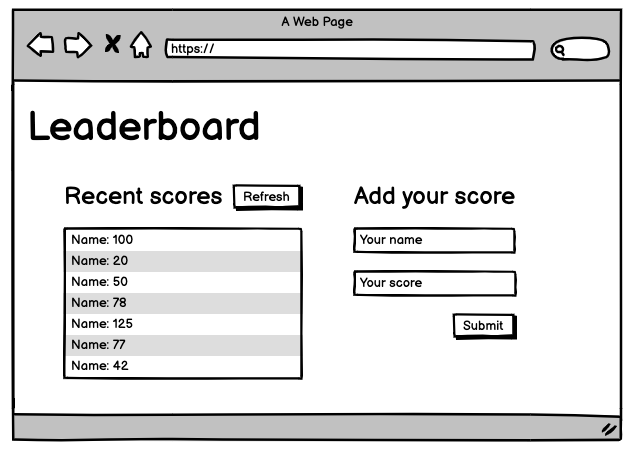
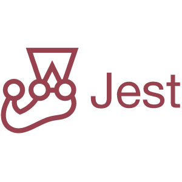

# Leaderboard

<p>
    This project is about a Leaderboard that display the best scrore game using the external Leaderboard API service.
</p>
<div>
    
</div>
<br>

## Built With





  
## Live Demo

<a href="#">Live Demo Link</a>

## Run tests

``` npm
    npm test

```

## Authors

👤 AZARIA SAIDI ALLY

- GitHub: [@azy64](https://github.com/azy64)
- LinkedIn: [LinkedIn](https://www.linkedin.com/in/azaria-saidi-524780112/)

## 🤝 Contributing

Contributions, issues, and feature requests are welcome!

Feel free to check the [issues page](../../issues/).

## Show your support

Give a ⭐️ if you like this project!

## Acknowledgments

- Hat tip to anyone whose code was used
- Inspiration
- etc

## 📝 License

This project is [MIT](./MIT.md) licensed.
